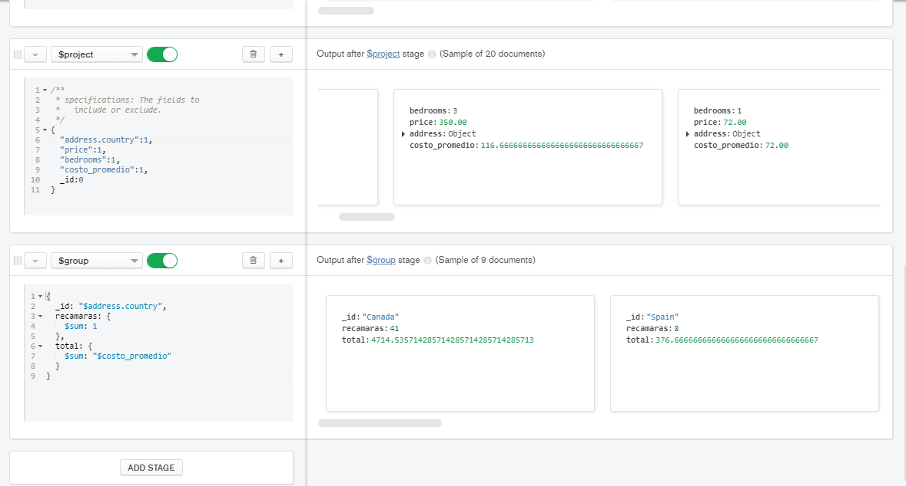
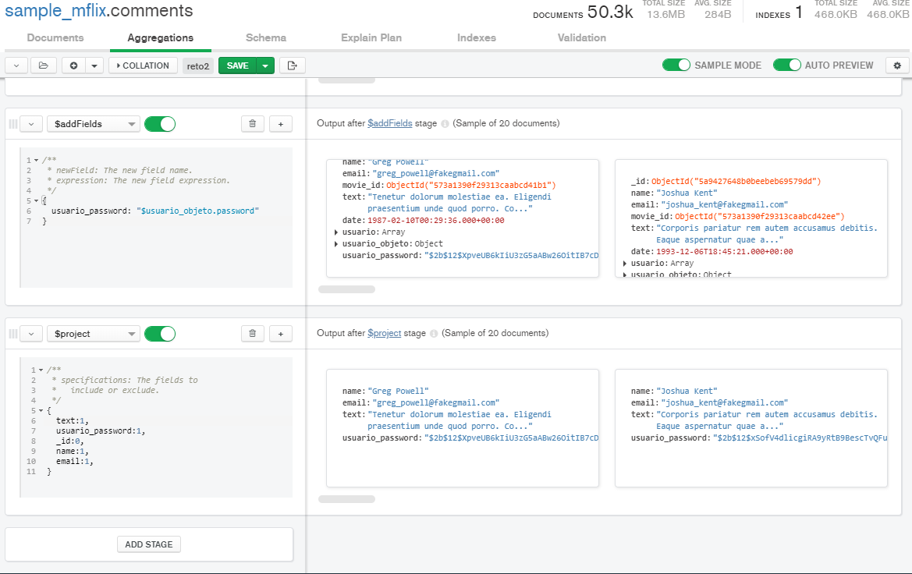
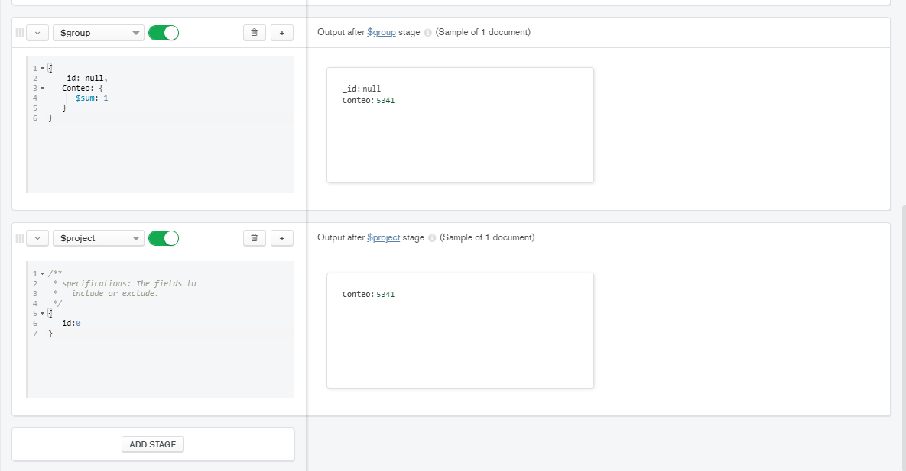

## Reto 1: Agrupamientos

Con base en el ejemplo 1, modifica el agrupamiento para que muestre el  costo promedio por habitación por país de las propiedades de tipo casa.

```json
[{$match: {
   property_type: 'House',
   bedrooms: {$gte: 1}
}}, {$addFields: {
  costo_promedio:{
    $divide:['$price','$bedrooms']
  }
}}, {$project: {
  "address.country":1,
  "price":1,
  "bedrooms":1,
  "costo_promedio":1,
  _id:0
}}, {$group: {
  _id: "$address.country",
  recamaras: {
    $sum: 1
  },
  total: {
    $sum: "$costo_promedio"
  }
}}]
```





## Reto 2: Asociación de colecciones

Usando las colecciones `comments` y `users`, se  requiere conocer el correo y contraseña de cada persona que realizó un  comentario. Construye un pipeline que genere como resultado estos datos.

```json
[{$lookup: {
  from: 'users',
  localField: 'name',
  foreignField: 'name',
  as: 'usuario'
}}, {$addFields: {
  usuario_objeto: {$arrayElemAt: ["$usuario", 0]}
}
}, {$addFields: {
  usuario_password: "$usuario_objeto.password"
}}, {$project: {
  text:1,
  usuario_password:1,
  _id:0,
  name:1,
  email:1,
}}]
```



## Reto 3: Introducción a las agregaciones

Usando la colección `sample_airbnb.listingsAndReviews`,  mediante el uso de agregaciones, encontrar el número de publicaciones  que tienen conexión a Internet, sea desde Wifi o desde cable (Ethernet).

```json
[{$match: {
   amenities: {$in: [/wifi/i, /net/i]}
}}, {$group: {
   _id: null,
   Conteo: {
      $sum: 1
   }
}}, {$project: {
  _id:0
}}]
```

## 




